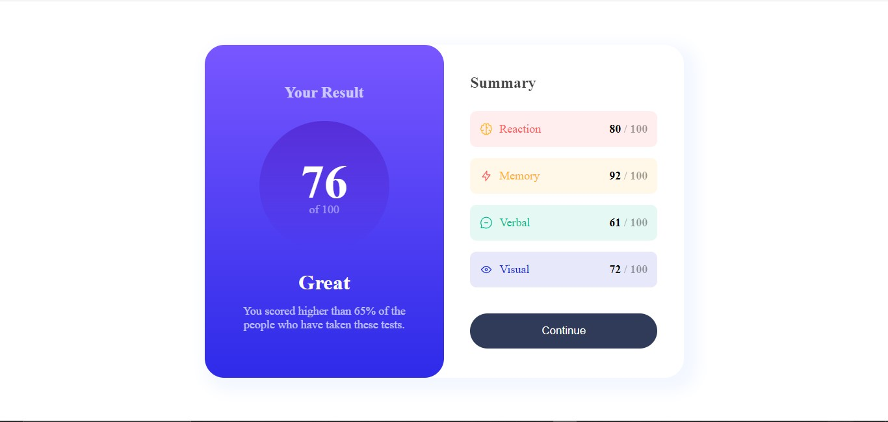

# Frontend Mentor - Results summary component solution

This is a solution to the [Results summary component challenge on Frontend Mentor](https://www.frontendmentor.io/challenges/results-summary-component-CE_K6s0maV). Frontend Mentor challenges help you improve your coding skills by building realistic projects. 

## Table of contents

- [Overview](#overview)
  - [The challenge](#the-challenge)
  - [Screenshot](#screenshot)
  - [Links](#links)
- [My process](#my-process)
  - [Built with](#built-with)
  - [What I learned](#what-i-learned)
  - [Continued development](#continued-development)
  - [Useful resources](#useful-resources)
- [Author](#author)
- [Acknowledgments](#acknowledgments)

## Overview

### The challenge

### Screenshot

- Solution URL: [Add solution URL here](https://github.com/Saviourjr/Result-Summary)
- Live Site URL: [Add live site URL here](https://saviourjr.github.io/Result-Summary/)

## My process

### Built with

- Semantic HTML5 markup
- CSS custom properties
- Flexbox
- CSS Grid

## Author

-
- Frontend Mentor - [@saviourjr](https://www.frontendmentor.io/profile/saviourjr)
- Twitter - [@saviour_jnr10](https://www.twitter.com/saviour_jnr10)

